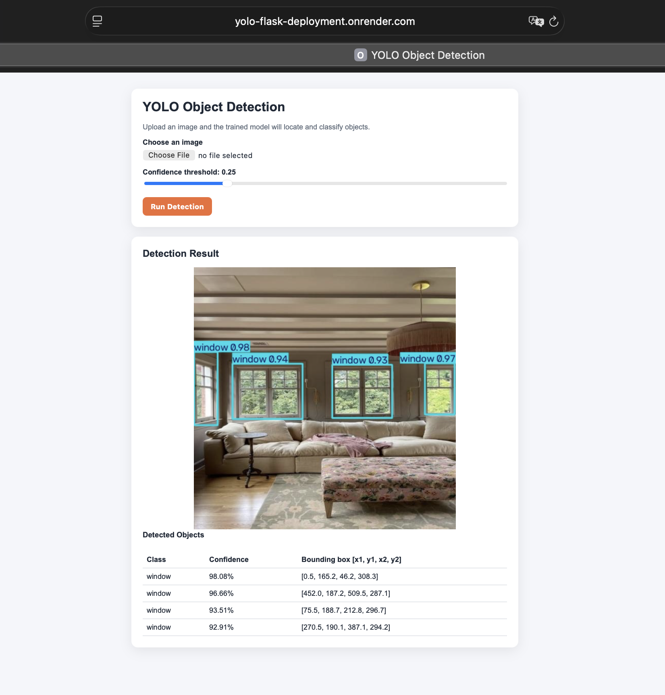

# YOLO Object Detection Flask Deployment

# deployment of YOLO object detecting Flask. In this project we utilize a simple Flask web application for deploying a trained YOLOv8 object detection model. The model was trained to identify two object classes:

- Lamp
- Window

Users upload an image, choose a confidence threshold, then get an annotated image of detected objects, class names, confidence scores, and bounding boxes.

## Live Application

Try the deployed app here:
(https://yolo-flask-deployment.onrender.com)

#### Application Preview



## How the Application Works

1. The user uploads an image through the web interface.  
2. Flask validates and stores the uploaded image.  
3. The image is evaluated via the trained YOLO model.  
4. YOLO returns detected classes, confidence scores, and bounding box coordinates.  
5. The application shows the annotated image and detection details.

## Project structure
```text
yolo_flask_deployment/
├── app.py
├── Dockerfile
├── requirements.txt
├── README.md
├── models/
│   └── best.pt
├── templates/
│   └── index.html
└── static/
    ├── style.css
    ├── uploads/
    └── results/
```
